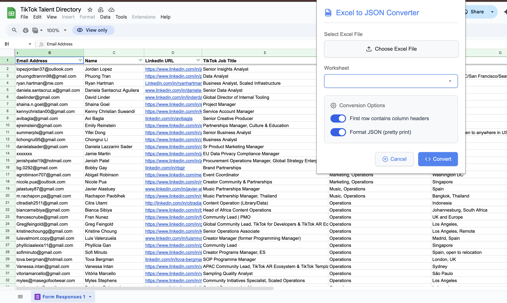

# 🧩 Excel to JSON Converter - Chrome Extension

Convert your Excel (`.xls`, `.xlsx`) files to JSON instantly using this simple and intuitive Chrome Extension. No need to upload files to a server—everything happens locally in your browser.

---

## 📸 Screenshots

**1. Extension Popup**  

---

## 🔧 Features

- 📁 Supports `.xls` and `.xlsx` file formats  
- 🔐 Fully client-side (your data never leaves your browser)  
- 🧾 Copy or download the JSON with one click  
- 💡 Clean and minimal UI  
- 🧪 Powered by [SheetJS](https://sheetjs.com/)

---

## 🚀 Getting Started

### 1. Try it Out

👉 [Install from the Chrome Web Store](https://chromewebstore.google.com/detail/excel-to-json-converter/hbhehcbafpmmadmlojcpfgdeolllmpip?hl=en-US&utm_source=ext_sidebar)

---

More sections like **Installation (from source)** or **How it works** can be added depending on your needs. Let me know if you'd like those too!
